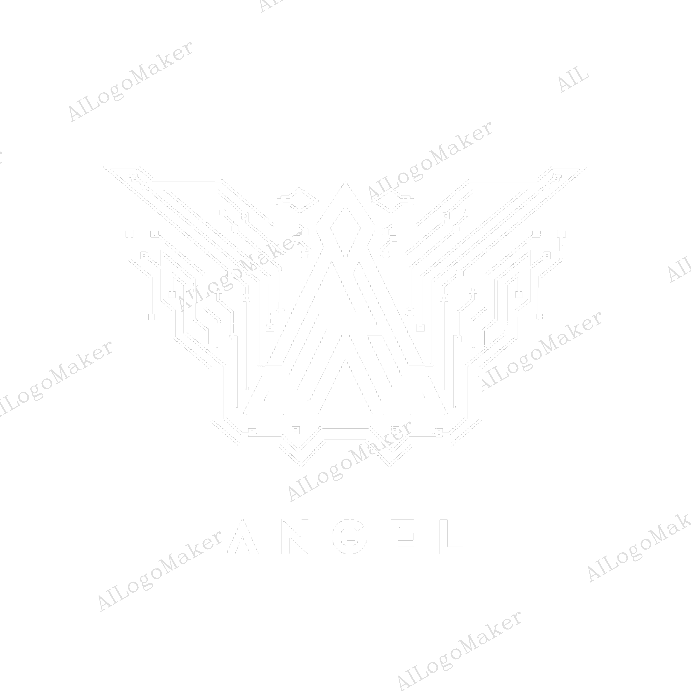

CV Personal - Página Web
Este proyecto es mi página web personal que muestra mi currículum vitae (CV), mis habilidades, experiencia laboral y proyectos previos. Está diseñado con HTML, CSS y JavaScript para proporcionar una vista profesional y moderna de mi perfil.

Contenido
HTML: Estructura básica de la página.
CSS: Estilos personalizados para un diseño atractivo.
JavaScript: Funcionalidades interactivas, como animaciones y efectos visuales.
Responsive: Optimizado para dispositivos móviles y escritorios.
Características
Sección de Introducción: Una breve descripción sobre mí.
Experiencia: Detalles sobre mi experiencia laboral.
Proyectos: Una galería con los proyectos en los que he trabajado.
Contacto: Formulario de contacto para facilitar la comunicación.
Tecnologías utilizadas
HTML5
CSS3
JavaScript

1. Introducción

Este documento describe la estructura y funcionalidad del código HTML proporcionado. Se trata de una página web personal de presentación profesional, incluyendo información sobre tecnologías utilizadas, servicios ofrecidos y proyectos realizados.

2. Estructura del Documento HTML

2.1. Declaración DOCTYPE y Elementos Iniciales

<!DOCTYPE html>
<html lang="es">

Define que el documento es un archivo HTML5.

Se especifica el idioma principal de la página como español ("es").

2.2. Sección <head>

<head>
  <meta charset="UTF-8" />
  <meta name="viewport" content="width=device-width, initial-scale=1.0" />
  <title>AND</title>
  <link rel="icon" type="image/png" href="assets/img/logo.png">
  <link rel="stylesheet" href="assets/css/styles.css" />
</head>

Se establece la codificación de caracteres como UTF-8 para soportar caracteres especiales.

Se define viewport para la adaptabilidad en dispositivos móviles.

Se especifica el título de la página AND.

Se enlaza un icono de página (favicon).

Se vincula una hoja de estilos CSS externa (styles.css).

3. Cuerpo de la Página (<body>)

3.1. Barra Lateral (Sidebar)

<aside class="sidebar">
  

    
  

  <button class="menu-toggle" id="open-menu">&#9776;</button>
  <nav class="nav-menu" id="nav-menu">
    <button class="close-menu" id="close-menu">&times;</button>
    <ul>
      <li><a href="#home" class="active">Home</a></li>
      <li><a href="#about">Stack Tecnológico</a></li>
      <li><a href="#services">Servicios</a></li>
      <li><a href="#portfolio">Portafolio</a></li>
      <li><a href="#contact">Contacto</a></li>
    </ul>
  </nav>
</aside>

Contiene un logo y un menú de navegación con enlaces a las diferentes secciones.

Se incluyen botones para abrir y cerrar el menú en dispositivos móviles.

3.2. Sección Principal (<main>)

3.2.1. Sección Hero (Presentación)

<section class="hero" id="home">
  

    <h1>Hola, mi nombre es Daniel Angel Ambrocio Coj</h1>
    <h2>Soy Full Stack Developer y Database Administrator</h2>
    
Ingeniero en Sistemas enfocado en Desarrollo Web...

    <a href="#about" class="btn">Mas acerca de mi!!</a>
  

  

    
  

</section>

Muestra una breve presentación personal con título, descripción y una imagen.

Botón para navegar a la sección "Stack Tecnológico".

3.2.2. Sección "Stack Tecnológico"

Se detalla la tecnologías utilizadas organizadas en tarjetas:

Bases de Datos: SQL Server, MySQL, PostgreSQL.

Lenguajes de Programación: Java, Python, C++, JavaScript.

Frameworks: Spring Boot, Flask.

Otros: HTML, CSS, Bootstrap.

3.2.3. Sección "Servicios"

Describe los servicios profesionales ofrecidos con tarjetas representando cada servicio:

Desarrollo Web y Software.

Diseño y Gestión de Bases de Datos.

Integración de APIs y Servicios Web.

Seguridad y Autenticación.

Automatización y Optimización.

3.2.4. Sección "Portafolio"

Presenta proyectos realizados con una descripción e imágenes interactivas en una galería modal.

4. Recursos Externos

4.1. Imágenes

Se almacenan en assets/img/.

Se utilizan para representar tecnologías, servicios y proyectos.

4.2. Hojas de Estilo (CSS)

assets/css/styles.css define la apariencia de la página.

Documentación del Archivo JavaScript (main.js)

Descripción

Este script proporciona funcionalidades clave para la navegación de la página, la interacción con una galería de imágenes y la validación de un formulario de contacto.

1. Gestión de Enlaces Activos en la Barra de Navegación

Objetivo:

Marcar automáticamente el enlace activo en la barra de navegación cuando el usuario se desplaza por la página.

Funcionamiento:

Se seleccionan todos los enlaces dentro del menú de navegación (.nav-menu a).

Se define la función setActiveLink() que:

Obtiene la posición actual de desplazamiento (scrollY) con un pequeño ajuste.

Recorre cada enlace para comprobar si la sección correspondiente está en la vista.

Si la sección está visible, se le agrega la clase active, de lo contrario, se elimina.

Se añade un evento scroll para ejecutar setActiveLink() cada vez que el usuario se desplace.

Código Clave:

window.addEventListener("scroll", setActiveLink);

2. Funcionalidad de la Galería de Imágenes

Objetivo:

Permitir la apertura, navegación y cierre de una galería de imágenes en un modal.

Funciones Principales:

openGallery(id):

Obtiene las imágenes dentro del contenedor de la galería especificada.

Guarda sus rutas en un array images.

Muestra la primera imagen en un modal.

openFullImage(src):

Muestra la imagen ampliada en el modal.

Actualiza currentIndex con la posición de la imagen seleccionada.

closeFullImage():

Oculta el modal de imagen ampliada.

changeImage(direction):

Cambia la imagen mostrada en el modal según la dirección (-1 para retroceder, 1 para avanzar).

Si llega al final, vuelve a la primera imagen y viceversa.

Navegación con el Teclado:

Flecha izquierda (ArrowLeft): Imagen anterior.

Flecha derecha (ArrowRight): Imagen siguiente.

Escape (Escape): Cierra el modal.

Código Clave:

document.addEventListener("keydown", function (event) {
  if (document.getElementById("fullImageModal").style.display === "flex") {
    if (event.key === "ArrowLeft") {
      changeImage(-1);
    } else if (event.key === "ArrowRight") {
      changeImage(1);
    } else if (event.key === "Escape") {
      closeFullImage();
    }
  }
});

3. Menú de Navegación Adaptable

Objetivo:

Abrir y cerrar un menú de navegación en pantallas pequeñas.

Funcionamiento:

document.getElementById("open-menu").addEventListener("click", ...): Agrega la clase active al menú.

document.getElementById("close-menu").addEventListener("click", ...): Remueve la clase active del menú.

Código Clave:

document.getElementById("open-menu").addEventListener("click", function () {
  document.getElementById("nav-menu").classList.add("active");
});

4. Validación del Formulario de Contacto

Objetivo:

Evitar el envío de un formulario con campos vacíos y mostrar alertas con mensajes de error.

Funcionamiento:

Se captura el formulario (.contact-form form).

Al enviarlo, se verifica que los campos name, email y message no estén vacíos.

Si hay errores, se muestra un alert con los mensajes de error y se evita el envío (event.preventDefault()).

Código Clave:

form.addEventListener("submit", function (event) {
  if (name === "") {
    errorMessage += "⚠️ El nombre no puede estar vacío.\n";
    valid = false;
  }
  if (!valid) {
    alert(errorMessage);
    event.preventDefault();
  }
});

Conclusión

Este script mejora la experiencia del usuario mediante:

Navegación intuitiva con enlaces activos.

Galería interactiva con navegación por teclado.

Menú adaptable en dispositivos móviles.

Validación de formularios para evitar errores en el envío.

RESET BÁSICO
* {
  margin: 0;
  padding: 0;
  box-sizing: border-box;
}
Propósito: El "reset" básico elimina el margen y el relleno predeterminado de todos los elementos de la página y establece el modelo de caja en "border-box". Esto ayuda a evitar inconsistencias en los navegadores, asegurando que los elementos ocupen el espacio de manera predecible.
2. ESTILOS GENERALES
css
Copiar
Editar
body {
  font-family: "Times New Roman", sans-serif;
  background-color: black;
  color: #fff;
  display: flex;
  min-height: 100vh;
}
Propósito: Se establece la fuente predeterminada como "Times New Roman", con un color de fondo negro (#000000) y texto blanco (#ffffff). Además, la propiedad display: flex hace que el cuerpo de la página utilice un modelo de diseño flexbox, permitiendo un fácil alineamiento y distribución de los elementos. La propiedad min-height: 100vh asegura que el contenido mínimo del cuerpo ocupe toda la altura de la ventana del navegador.
3. SIDEBAR
.sidebar {
  position: fixed;
  top: 0;
  left: 0;
  width: 100%;
  background: #111;
  color: white;
  display: flex;
  align-items: center;
  justify-content: space-between;
  padding: 10px 20px;
  box-shadow: 0px 2px 5px #00aaff;
  z-index: 1000;
}
Propósito: Define una barra lateral fija (siempre visible), que ocupa el ancho completo de la pantalla, con un fondo oscuro (#111) y texto blanco. Los elementos dentro de la barra se distribuyen mediante flexbox, con alineación centrada verticalmente y separación entre ellos. También tiene una sombra sutil (box-shadow) de color azul claro (#00aaff) para darle profundidad.
4. TEXTOS Y SECCIONES
4.1 Hero Text
.hero-text p {
  font-size: 18px;
  text-align: justify;
  line-height: 1.6;
}
Propósito: Los párrafos dentro de la clase .hero-text se muestran con un tamaño de fuente de 18px, con texto justificado y una altura de línea de 1.6 para mejorar la legibilidad.
4.2 About Section
.about-section p {
  font-size: 18px;
  text-align: justify;
  line-height: 1.6;
}
Propósito: Similar a la clase .hero-text, los párrafos dentro de .about-section también tienen un tamaño de fuente de 18px, texto justificado y una altura de línea de 1.6, lo que mejora la lectura del contenido.
5. LOGO

.logo img {
  width: 120px;
  height: auto;
  display: block;
}
Propósito: Las imágenes dentro de la clase .logo se ajustan a un ancho de 120px, manteniendo la proporción original de la imagen con height: auto. Además, la propiedad display: block asegura que la imagen se comporte como un bloque, evitando espacios vacíos debajo de ella.
6. MENÚ HAMBURGUESA Y NAVEGACIÓN
6.1 Botones de menú

.menu-toggle, .close-menu {
  display: none;
  background: none;
  border: none;
  color: white;
  font-size: 2rem;
  cursor: pointer;
}
Propósito: Los botones para abrir y cerrar el menú hamburguesa (representados por .menu-toggle y .close-menu) están inicialmente ocultos mediante display: none, con un diseño sencillo (sin fondo ni borde) y texto blanco. Su tamaño de fuente es grande (2rem) y el cursor cambia a "pointer" al pasar sobre ellos, lo que indica que son interactivos.
6.2 Navegación

.nav-menu {
  display: flex;
}

.nav-menu ul {
  list-style: none;
  display: flex;
  margin: 0;
  padding: 0;
}

.nav-menu li {
  margin: 0 15px;
}

.nav-menu a {
  text-decoration: none;
  color: #fff;
  font-size: 1.2rem;
  transition: color 0.3s ease;
}

.nav-menu a.active, .nav-menu a:hover {
  color: #00aaff;
}
Propósito: Los enlaces de navegación dentro de .nav-menu están diseñados como una lista horizontal, sin estilo de lista predeterminado (list-style: none). Los elementos de la lista tienen un margen de 15px entre ellos. Los enlaces tienen un color blanco predeterminado y, al pasar el mouse sobre ellos o cuando están activos, cambian a un color azul claro (#00aaff) con una transición suave de 0.3 segundos.
6.3 Menú Responsivo

@media (max-width: 768px) {
  .menu-toggle {
    display: block;
  }

  .nav-menu {
    position: absolute;
    top: 60px;
    left: 0;
    width: 100%;
    background: #111;
    display: none;
    flex-direction: column;
    align-items: center;
    text-align: center;
    padding: 10px 0;
  }

  .nav-menu ul {
    flex-direction: column;
  }

  .nav-menu li {
    margin: 10px 0;
  }

  .close-menu {
    display: block;
  }

  .nav-menu.active {
    display: flex;
  }
}
Propósito: Para pantallas con un ancho máximo de 768px (dispositivos móviles), se muestra el botón del menú hamburguesa (.menu-toggle). La barra de navegación se muestra en una columna vertical con los enlaces centrados y se oculta por defecto. Cuando se activa (.nav-menu.active), se muestra de forma vertical, y el botón de cerrar (.close-menu) se hace visible.
7. CONTENIDO PRINCIPAL

.main-content {
  flex: 1;
  padding: 40px;
}
Propósito: La clase .main-content ocupa el espacio restante dentro del contenedor principal gracias a flex: 1, con un relleno de 40px alrededor de su contenido.
8. SECCIÓN HERO

.hero {
  display: flex;
  align-items: center;
  justify-content: space-between;
  gap: 20px;
  margin-top: 150px;
  margin-bottom: 200px;
}

.hero-text {
  max-width: 700px;
}

.hero-text h1, .hero-text h2 {
  margin-bottom: 10px;
}

.hero-text h1 {
  font-size: 2.5rem;
}

.hero-text h2 {
  font-size: 2rem;
}

.hero-text h1 span, .hero-text h2 span {
  color: #00aaff;
}

.hero-text p {
  margin-bottom: 20px;
  line-height: 1.6;
  color: #ccc;
}
Propósito: La sección .hero utiliza flexbox para alinear y distribuir el contenido, con un espacio de 20px entre los elementos. La clase .hero-text limita el ancho máximo a 700px. Los encabezados (h1, h2) tienen un espaciado de 10px debajo, y se utiliza un color azul (#00aaff) para resaltar las partes importantes del texto. Los párrafos dentro de .hero-text tienen un color gris claro (#ccc) para mejorar la legibilidad.
9. BOTÓN

.btn {
  display: inline-block;
  background-color: #00aaff;
  color: #fff;
  padding: 12px 24px;
  border-radius: 4px;
  text-decoration: none;
  transition: background-color 0.3s ease;
}

.btn:hover {
  background-color: #00aaff;
}
Propósito: Los botones tienen un fondo azul (#00aaff), texto blanco, y un radio de borde de 4px. El estilo de los botones se hace interactivo al pasar el ratón sobre ellos, pero el fondo no cambia ya que el color de fondo en el hover es el mismo. Sin embargo, la transición suave de 0.3 segundos hace que el cambio de color sea fluido en otros elementos si se cambia el valor.
